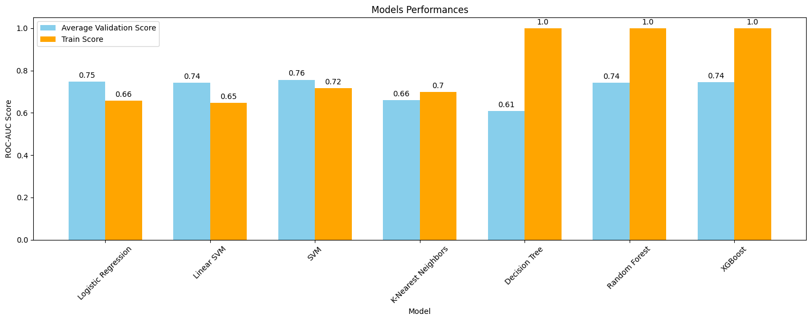
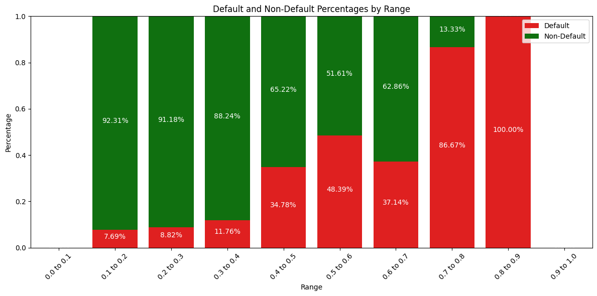
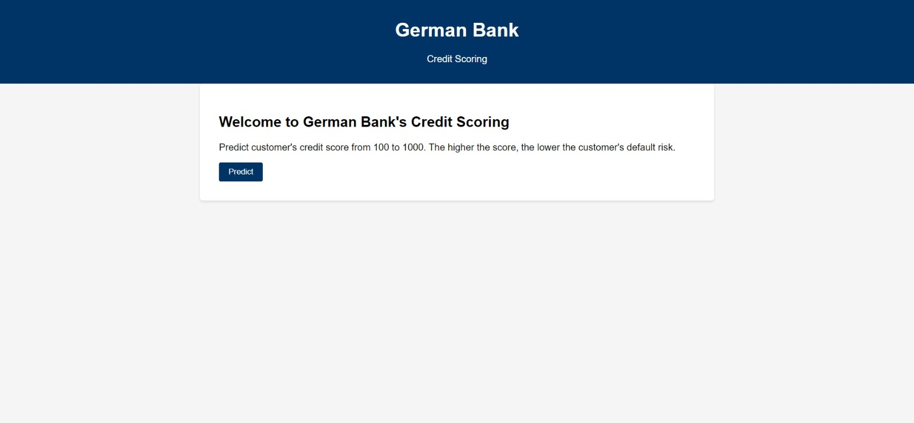

# German Bank's Credit Scoring

# 1. Description
- This is an end-to-end machine learning project using Random Forest to assign credit scores to potential customers of a German Bank. It involves supervised learning (using a labeled training set) for classification, where the target is 1 if the customer defaulted on a loan, else 0.
- I implemented this project following some CI/CD principles and using modular coding. First, I developed my entire analysis (from EDA to modeling) in notebooks. Then, I divided the project development into components responsible for data ingestion, transformation, and model training, following the same steps as in the notebooks. Once I had done this, I created scripts for automating the training and prediction pipelines using these components. The training pipeline executes them and obtains all the machine learning model artifacts, while the prediction pipeline makes predictions by consuming the obtained artifacts. All of this was made with good practices like virtual environment use (isolating dependencies), exception handling, loggings, documentation (every script/function/class purposes and definitions are defined inside the files), etc. Afterward, I built a web app in Flask, integrating everything mentioned above. My objective with this was to get closer to a real data science project workflow by packaging my entire project as a package.

# 2. Technologies and tools
- The technologies and tools used were Python (Pandas, Numpy, Matplotlib, Seaborn, Scikit-Learn, Category-Encoders, Scikit-Optimize, Xgboost, Flask), Jupyter Notebook, Git and Github (version control), machine learning classification algorithms, statistics, Anaconda (terminal) and Visual Studio Code (project development environment).

# 3. Business problem and project objective
Context:

Banks generate profit in the credit context by lending money to borrowers and charging interest on the loans. The Return on Equity (ROE) is a key metric that measures the bank's profitability by comparing its net income to the shareholders' equity. Higher ROE indicates more efficient profit generation.

ROE = (Net Income / Shareholders' Equity) * 100

Credit risk refers to the potential of borrowers defaulting on their loan payments, which can lead to financial losses for banks. Banks aim to control credit risk because it safeguards their financial stability and reputation. Managing credit risk involves assessing the likelihood of default and implementing strategies to minimize losses.

Banks use predictive models to estimate the probability of a customer defaulting on a loan. These models analyze various factors like credit history, income, and economic indicators. Credit scores are then assigned to customers, helping banks make informed lending decisions. This approach enhances risk management and improves the overall quality of the loan portfolio.

In summary, the credit cycle involves three primary phases: origination, where loans are granted to borrowers; monitoring, where borrowers' financial health is tracked to prevent defaults; and collection, which involves recouping funds from delinquent borrowers or defaulted loans. The focus here is to prevent default, protecting the bank from these delinquent borrowers.

Problem statement: The German Bank aims to predict the probability of its customers defaulting on a loan and assign credit scores to them. It is facing issues in its operations due to a significant portion of bad risk clients.

Considering this, the project objectives are:

1. Identify the factors associated with credit risk in the form of business insights.
2. Offer suggestions for the bank to minimize credit risk in its operations.
3. Construct a model capable of accurately predicting the probability of a customer defaulting on a loan, assigning a credit score to him. In order to achieve this, ROC-AUC will be the metric of interest.

By doing this, we generate numerous benefits for the german bank, such as: Improved risk management, reduced financial losses, informed lending decisions, enhanced portfolio quality, better regulatory compliance, increased profitability, and greater customer satisfaction.

And as a result, the mentioned business problem is resolved.

# 4. Solution pipeline
The following pipeline was used, based on CRISP-DM framework:

1. Define the business problem.
2. Collect the data and get a general overview of it.
3. Split the data into train and test sets.
4. Explore the data (exploratory data analysis)
5. Data cleaning and preprocessing.
6. Model training, comparison, selection and tuning.
7. Final production model testing and evaluation.
8. Conclude and interpret the model results.
9. Deploy.

Each step is explained in detail inside the notebooks, where I provide the rationale for the decisions made

# 5. Main business insights
1. Young customers tend to present higher credit risk. This makes sense since younger people usually don't have financial stability.
2. Customers who take higher credit amounts from the bank tend to present higher risk. This makes total sense. The higher the credit amount taken, the harder it is to pay it.
3. Customers whose credit services have a long duration present higher risk. The more time a customer spends using a credit service without paying it, the higher the risk of default.

Examining the WOE and Default Probability, it becomes evident that as the duration (in months) increases, the default rate increases. Look how durations of 24-36 months, 36-48 months and 48-60 months present a higher default probability when compared to the total and the other categories:

4. Credit amount and Duration are strongly positively correlated. Credit services with longer durations generally are associated with higher credit amounts and vice-versa.

5. Customers with little saving and checking accounts tend to present higher credit risk. Particularly, almost 50% of the customers who have little checking accounts are defaulters. 

6. When a customer takes credit from the bank for vacation/others and education purposes, it must be alert. Specifically, almost 50% of the customers who took credit for education defaulted on the loan. Moreover, on average, customers who have highly skilled jobs, free housing, and vacation/other purposes tend to borrow larger credit amounts from the bank and, consequently, for longer durations, presenting higher levels of risk. 

# 6. Modelling

1. For preprocessing, since features like savings and checking accounts exhibit ordinal relationships and purposes have higher cardinality, as a good data scientist, I compared two preprocessing approaches. The first approach involved applying ordinal encoding and target encoding to prevent overfitting by increasing dimensionality. The second approach involved applying one-hot encoding. Surprisingly, even with a small amount of data and an increase in dimensionality, one-hot encoding the categorical features and standard scaling the numerical ones performed better!
2. I chose a set of models for performance comparison, analyzing the ROC-AUC score. Accuracy is not a good metric because the target is imbalanced. Moreover, the ROC-AUC score is the metric of focus when building a credit scoring model because it effectively measures the model's ability to discriminate between defaulters and non-defaulters, providing a comprehensive evaluation of its predictive power. 
3. In order to select the best model for hyperparameter tuning and final evaluation, I trained and evaluated each of the models using stratified k-fold cross-validation, which provides a more reliable performance estimate. Then, I balanced a higher average validation ROC-AUC score with the bias-variance trade-off.
4. Although SVM had the best average validation score, I chose Random Forest for the next steps because there was more room for performance improvement with it. It was overfitting (low bias and high variance), and I could apply some regularization to enhance its generalization ability. Moreover, XGBoost performed slightly better than Random Forest, however I chose the latter because it is an ensemble method that uses a bagging technique, which may be better for preventing overfit. Additionally, it is faster, more efficient, and offers relatively simplicity and interpretability.

5. I tuned Random Forest model with Bayesian Search because it uses probabilistic models to intelligently explore the hyperparameter space, balancing exploration and exploitation. An important point here was to define a class_weight hyperparameter, such that the estimator was able to better learn the patterns in minority target class (defaulters). As expected, some regularization was applied. The training error and bias have increased (the training ROC-AUC score dropped from 1.0 to 0.875818), while the variance has decreased. Consequently, it was possible to improve the average validation roc-auc score from 0.734189 to 0.763281, good.
6. I evaluated the results. Since the project's goal was to build a model capable of effectively distinguishing between customers who will default on loans and those who will not, aiming for a high ROC-AUC score, the objective was achieved. The ROC-AUC score on the test set was equal to 0.78, and other metrics for defaulters, such as recall and precision, also showed good values.

7. Then, with the intention of assigning credit scores, I divided the model's estimated probabilities of default into ranges and analyzed their distributions using various approaches. Clearly, there was a trend: as the range increased, the percentage of defaulters also increased. This demonstrated that our scores were following a certain ordering, allocating larger proportions of defaulters to higher ranges. Therefore, the task was successfully completed, and the business problem has been resolved. Now, the bank can assess a credit score for each potential customer, indicating how risky he is.

# 7. Financial results
I estimated the financial outcome to assess whether the project is worthwhile. Although I did not have access to specific data to obtain the exact financial gain, I assumed a loan charge of 3% per month. Then, I calculated the Return On Equity (ROE) before and after changing the bank's credit policy while building my model. To do this, I computed the expected revenue from non-defaulters' loans, the expected loss from defaulters' loans, and the total credit amount lent. Finally, after extending credit only to customers with a credit score of 6 or higher, the ROE increased from 9.55% to 42.64%. This illustrates the power of machine learning and data science. Consequently, my project is worthwhile and effectively addresses the business problem! An important observation is that this estimation was made using only the test set because the probabilities in the training set would be much more accurate, which does not represent the real production environment performance.

# 8. Web app and next steps.
I developed a Flask web app that allows us to obtain a credit score for any potential customer by providing input feature information. For the next steps, I will be focused on deploying this app on a cloud platform like AWS. I've already defined a file containing Elastic Beanstalk configuration, .ebextensions/config.py. Anyway, in the next topic, I will describe how you can run this project on your local machine.

Web app home page:

Web app credit scoring page:

Web app credit scoring output example:

# 9. Run this project on your local machine
Prerequisites:

Before getting started, make sure you have the following installed on your machine:
- Python 3.11.4
- pip (Python package manager)
- Git (Version control tool)

Once you have this installed, open a terminal on your local machine and run the following commands:

1. Clone the repository:
<pre>
https://github.com/allmeidaapedro/Credit-Scoring-German-Bank.git
</pre>

2. Navigate to the cloned repository directory:
<pre>
cd Credit-Scoring-German-Bank
</pre>

3. Create a virtual environment:
<pre>
python -m venv venv
</pre>

4. Activate the Virtual Environment:

Activate the virtual environment used to isolate the project dependencies.
<pre>
source venv/bin/activate  # On Windows, use 'venv\Scripts\activate'
</pre>

5. Install Dependencies:

Use pip to install the required dependencies listed in the requirements.txt file.
<pre>
pip install -r requirements.txt
</pre>

6. Run the Application:
<pre>
python application.py
</pre>

7. Access the Project Locally:

After running successfully, you can access the project locally. Open a web browser and navigate to http://127.0.0.1:5000/

Then, go to the credit scoring page, select the input features values and click on submit. The credit score for a customer will appear on the right side.

7. Shutdown the Application:

To stop the application, you can typically press Ctrl+C in the terminal where the application is running.

8. Deactivate the Virtual Environment:

When you're done with the project, deactivate the virtual environment.

<pre>
deactivate
</pre>

# 9. Dataset link
The dataset was collected from kaggle and it belongs to UCI machine learning repository.

Link: https://www.kaggle.com/datasets/kabure/german-credit-data-with-risk

# 10. Contact me
Linkedin: https://www.linkedin.com/in/pedro-henrique-almeida-oliveira-77b44b237/

Github: https://github.com/allmeidaapedro

Gmail: pedrooalmeida.net@gmail.com
